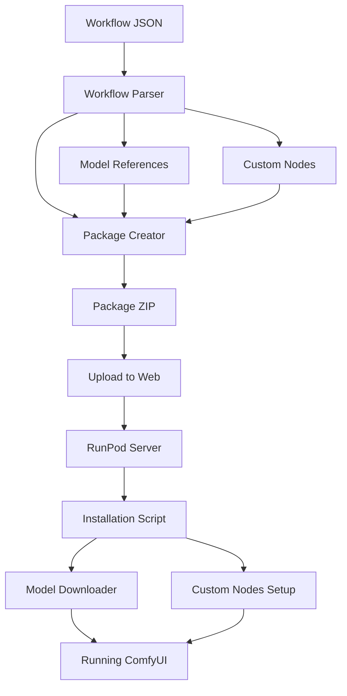

# ComfyUI RunPod Package System

## Overview

This system streamlines the process of packaging ComfyUI workflows with their dependencies and deploying them to RunPod servers. It focuses on reliability, efficiency, and ease of use, enabling users to seamlessly share and deploy ComfyUI workflows with all required models and custom nodes.

## Key Components

| Component | File | Purpose |
|-----------|------|---------|
| Interactive Package Creator | `scripts/interactive_package_creator.py` | Creates packages from workflows with interactive model discovery |
| Simplified Workflow Parser | `scripts/simplified_workflow_parser.py` | Extracts model references from workflows without resolving paths |
| Complete Workflow Parser | `scripts/workflow_parser.py` | Full-featured parser with enhanced path resolution |
| Model Downloader | `scripts/model_downloader.py` | Handles robust model downloading with Civitai API integration |
| Installation Script | `install_package.sh` | Deploys packages on RunPod servers |
| Installation Tester | `test_installation.py` | Verifies correct installation |
| Main Interface | `example.py` | Provides a unified command-line interface |

## System Architecture



## Process Flow

1. **Workflow Analysis**: The workflow parser identifies custom nodes and model references in a ComfyUI workflow.
2. **Interactive Package Creation**: The package creator guides the user through model discovery and classification.
3. **Package Assembly**: All dependencies are bundled into a standardized package structure.
4. **Deployment**: The package is uploaded to a web-accessible location.
5. **Installation**: The installation script downloads and installs the package on a RunPod server.
6. **Verification**: The installation tester ensures everything is working correctly.

## Project Structure

```
ComfyUI-RunPod/
├── scripts/
│   ├── interactive_package_creator.py  # Interactive package creation
│   ├── simplified_workflow_parser.py   # Simple model reference extraction
│   ├── workflow_parser.py              # Advanced dependency detection
│   └── model_downloader.py             # Robust model downloading
├── install_package.sh                  # RunPod installation script
├── test_installation.py                # Installation verification
├── example.py                          # Unified command-line interface
├── README.md                           # Main documentation
└── SUMMARY.md                          # This file
```

## Key Features

1. **Interactive Model Discovery**: 
   - Guides users through identifying and locating models
   - Supports various model types (checkpoints, LoRAs, VAEs, etc.)
   - Helps handle large models intelligently

2. **Comprehensive Custom Node Management**:
   - Detects custom nodes used in workflows
   - Collects Python package requirements
   - Establishes proper installation order

3. **Robust Model Downloading**:
   - Civitai API integration
   - Retry mechanism for reliability
   - Progress reporting with ETA
   - Hash verification for data integrity
   - Support for parallel downloads

4. **Streamlined Deployment**:
   - One-command installation
   - GPU optimization settings
   - Proper dependency management

## Usage Instructions

### Creating a Package

```bash
python example.py create path/to/your_workflow.json --comfyui-dir /path/to/comfyui
```

Options:
- `--output NAME`: Custom name for the output package
- `--output-dir DIR`: Directory to save the package
- `--civitai-key KEY`: Civitai API key for model downloads
- `--size-threshold GB`: Size threshold for large models (default: 2GB)
- `--no-manager`: Don't include ComfyUI-Manager in the package

### Analyzing a Workflow

```bash
python example.py analyze path/to/your_workflow.json --comfyui-dir /path/to/comfyui
```

### Testing an Installation

```bash
python example.py test --comfyui-dir /path/to/comfyui
```

### Installing a Package on RunPod

```bash
bash -c "$(curl -sSL https://raw.githubusercontent.com/yourusername/comfyui/main/install_package.sh)" -- --package URL_TO_YOUR_PACKAGE
```

## Requirements

- Python 3.8 or higher
- `requests` library for downloading
- `pyyaml` for configuration parsing
- ComfyUI installation (for package creation)

## Benefits

- **Simplicity**: Intuitive interface with step-by-step guidance
- **Reliability**: Robust error handling and verification
- **Efficiency**: Optimized downloads and installations
- **Compatibility**: Works with various model repositories and custom node structures
- **Customizability**: Flexible configuration options for different deployment scenarios
